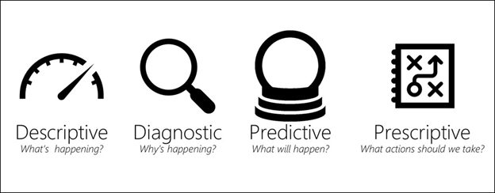

# Overview of Data Analysis

**Data Analysis** is the process of identifying, cleaning, transforming, and modeling data to discover meaningful and useful information.

The data is then crafted into a **story** through reports for analysis to support the critical decision-making process.

The **core components** of analytics are divided into the following categories:
- Descriptive
- Diagnostic
- Predictive
- Prescriptive
- Cognitive

## Descriptive analytics

Descriptive analytics help answer questions about **what** has happened based on historical data. 

An example of descriptive analytics is generating reports to provide a view of an organization's sales and financial data.

## Diagnostic analytics

Diagnostic analytics help answer questions about **why** events happened.

## Predictive analytics

Predictive analytics help answer questions about what will happen in the future. Predictive analytics techniques use historical data to identify trends and determine if they're likely to recur. 

Predictive analytical tools provide valuable insight into what might happen in the future. Techniques include a variety of statistical and machine learning techniques such as neural networks, decision trees, and regression.

## Prescriptive analytics

Prescriptive analytics help answer questions about which actions should be taken to achieve a goal or target. 

Prescriptive analytics techniques rely on **machine learning** as one of the strategies to find patterns in large semantic models. 

By analyzing past decisions and events, organizations can estimate the likelihood of different outcomes.

## Cognitive analytics

Cognitive analytics help you learn what might happen if circumstances change and determine how you might handle these situations.

Cognitive analytics attempt to draw **inferences** from existing data and patterns, derive conclusions based on existing knowledge bases, and then add these findings back into the knowledge base for future inferences, a self-learning feedback loop. 

Effective cognitive analytics depend on machine learning algorithms.