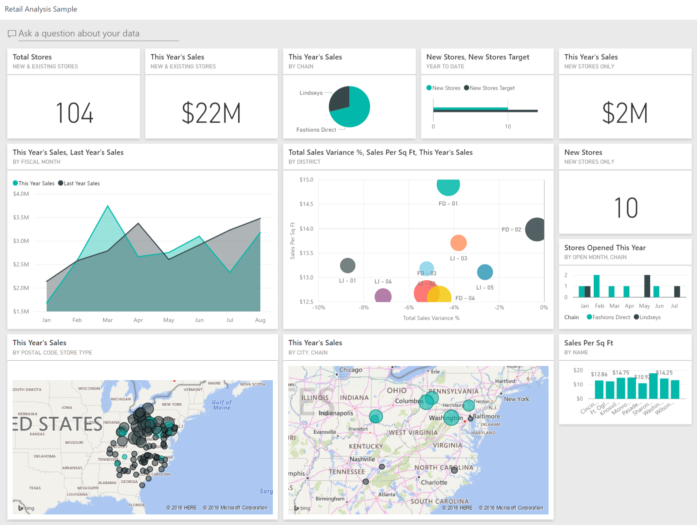

# Building blocks of Power BI

The building blocks of Power BI are:
- semantic models
- visualizations

## Semantic Models

A **semantic model** consists of all connected data, transformations, relationships, and calculations. 

To follow the flow of Power BI, you first connect to data, transform data, and create relationships and calculations to create a semantic model.

## Visualizations

In Power BI Desktop, when you create a **visualization** (also called *visual*), you add it to the **canvas** for a report page.

Power BI is a **low-code solution**, which means that you can *drag and drop* data field directly onto the canvas. 

One of the most valuable features of Power BI reports is the **interactivity between visuals**. Consumers can select different data points in the visual and see how that affects the other visuals. Depending on your design, they can also drillthrough from one visual to more detail or filter based on different fields in the report.

Once you're satisfied with your report, you publish it to the Power BI service.

## Dashboards

In the Power BI service, you can also create dashboards after you've published a report. Dashboards are an excellent way to provide high-level information to consumers.

Dashboards consist of a **single page** made up of **tiles**. 

Add tiles to a dashboard by pinning a visual in a report to the dashboard. 

Tiles aren't interactive like visuals, so when a user interacts with the tile, they go to the underlying report for more information.

