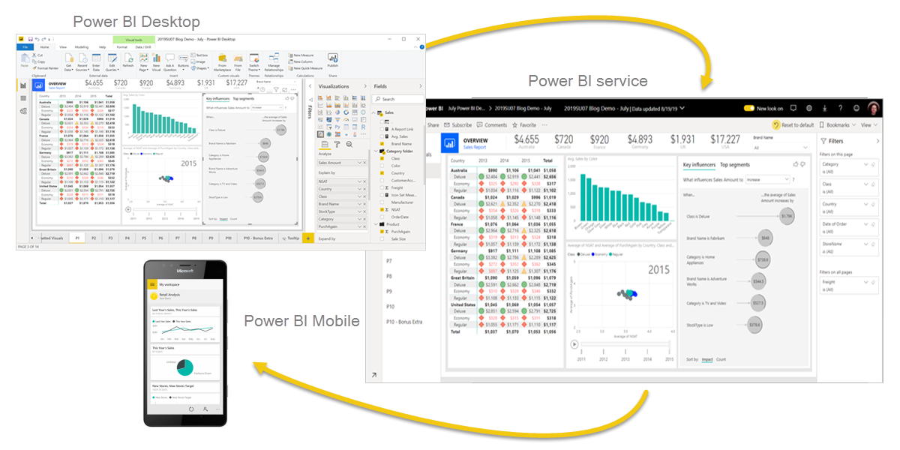

# Power BI

There are three primary components to Power BI:
- **Power BI Desktop** (desktop application)
- **Power BI service** (online platform)
- **Power BI Mobile** (cross-platform mobile app)

## Power BI Desktop

Power BI Desktop is the development tool available to data analysts and other report creators. 

Power BI Desktop is available to **download for free** either through the Windows store or directly online.

## Power BI Service

Power BI service allows you to organize, manage, and distribute your reports and other Power BI items.

You can access the Power BI service at [app.powerbi.com](https://app.powerbi.com).

## Power BI Mobile

Power BI Mobile allows consumers to view reports in a mobile-optimized format.

## The Flow of Power BI

The flow of Power BI is:

1. connect to data with Power BI Desktop
2. transform and model data with Power BI Desktop
3. create visualizations and reports with Power BI Desktop
4. publish report to Power BI service
5. distribute and manage reports in the Power BI service
