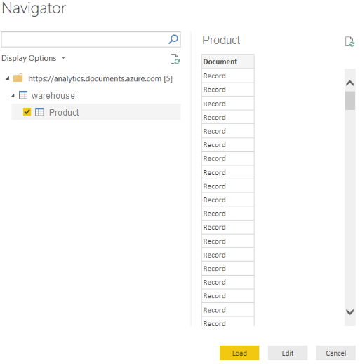
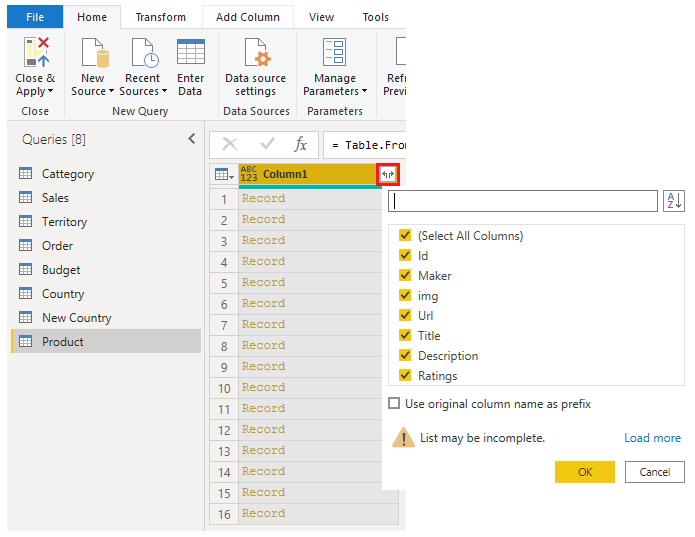

# Get data from a NoSQL database

A NoSQL database (also referred to as *non-SQL*, not only SQL or *non-relational*) is a flexible type of database that doesn't use tables to store data.

Data is stored (for example) as JSON documents, which are open standard file formats that are primarily used to transmit data between a server and web application.

## Connect to data in a NoSQL database

If you're working with data stored in JSON format, it's often necessary to extract and normalize the data first. This is because JSON data is often stored in a nested or unstructured format, which makes it difficult to analyze or report on directly.

After you've connected to the database account, the **Navigator** window opens, showing a list of databases under that account. Select the Edit button to open the records (*) in Power Query.

In Power Query, select the Expander button to the right side of the *Column1* header, which displays the context menu with a list of fields. Select the fields that you want to load into Power BI Desktop, clear the *Use original column name as prefix* checkbox, and then select OK.

(*) NOTE. The preview pane only shows Record items because all records in the document are represented as a Record type in Power BI.

