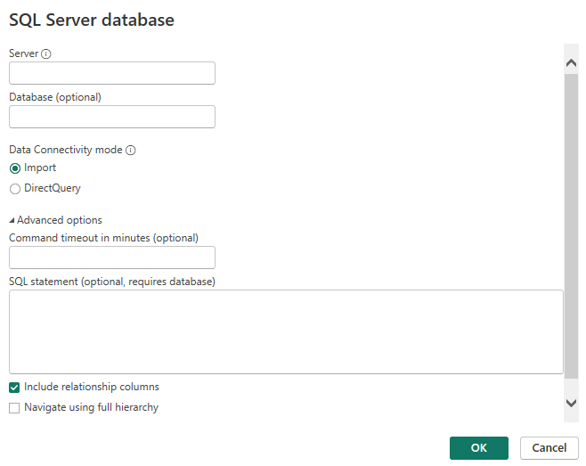
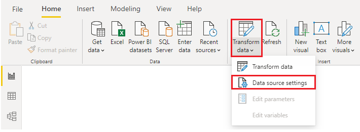

# Get data from relational database

Power BI Desktop can connect to many relational databases that are either in the cloud or on-premises.

## Connect to data in a relational database

After the database has been connected to Power BI Desktop, the **Navigator** window displays the data that is available in your data source. 

You can select a table or entity to preview its contents and make sure that the correct data will be loaded into the Power BI model.

You have two options:
- **Load**
    - Automatically load your data into a Power BI model in its current state
- **Transform**
    - Open your data in **Power Query**, where you can perform actions such as deleting unnecessary rows or columns, grouping your data, removing errors, and many other data quality tasks

## Import data by writing an SQL query

Another way you can import data is to write an **SQL query** to specify only the tables and columns that you need.

When using an SQL query to import data, try to avoid using the wildcard character (*) in your query. This method isn't recommended because it will lead to redundant data in your semantic model, which will cause performance issues and require extra steps to normalize your data for reporting. It's a best practice to avoid doing this directly in Power BI. Instead, consider writing a query like this in a **view**. 

## Change data sources settings

After you create a data source connection and load data into Power BI Desktop, you can return and change your connection settings at any time. 

