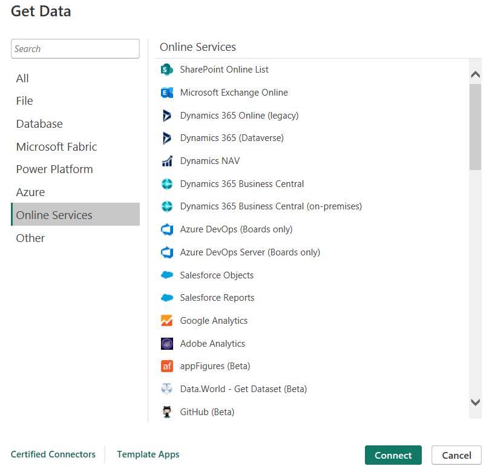

# Get data from online services

To support their daily operations, organizations frequently use a range of software applications. These applications produce their own data. Power BI can combine the data from multiple applications to produce more meaningful insights and reports.

## Connect to data in an application

When connecting to data in an application, you would begin in the same way as you would when connecting to the other data sources: by selecting the **Get data** feature in Power BI Desktop. Then, select the option that you need from the **Online Services** category.

After Power BI has made the connection with the application (e.g. SharePoint), the **Navigator** window appears, as it does when you connect to other data sources. 

Similar to when you import from other data sources, you have two options:
- automatically load your data into a Power BI model
- launch the Power Query Editor to transform your data (before loading it)

