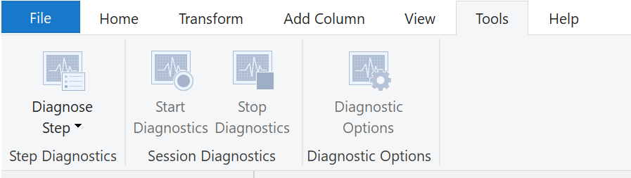

# Fix performance issues

Occasionally, organizations will need to address performance issues when running reports. Power BI provides the **Performance Analyzer tool** to help fix problems and streamline the process.

The performance in Power Query depends on the performance at the data source level. The variety of data sources that Power Query offers is wide, and the performance tuning techniques for each source are equally wide. 

Power Query takes advantage of good performance at the data source through a technique called **Query Folding**. Another option is **Query Diagnostics**.

## Query Folding

**Query Folding** is the process by which the transformations and edits that you make in Power Query Editor are simultaneously tracked as native queries, or simple Select SQL statements, while you're actively making transformations. 

The reason for implementing this process is to ensure that these transformations can take place in the original data source server and don't overwhelm Power BI computing resources.

The benefits to query folding include:
- more efficiency in data refreshes and incremental refreshes
- automatic compatibility with DirectQuery and Dual storage modes

## Query Diagnostics

Another tool that you can use to study query performance is **Query Dagnostics**. You can determine what bottlenecks may exist while loading and transforming your data, refreshing your data in Power Query, running SQL statements in Query Editor, and so on.

## Other techniques to optimize performances

Other ways to optimize query performance in Power BI include:
- process as much data as possible in the original data source
- use native SQL queries
    - make sure that you aren't pulling data from stored procedures or common table expressions (CTEs)
- separate date and time (if bound together)
    - this approach will increase compression abilities