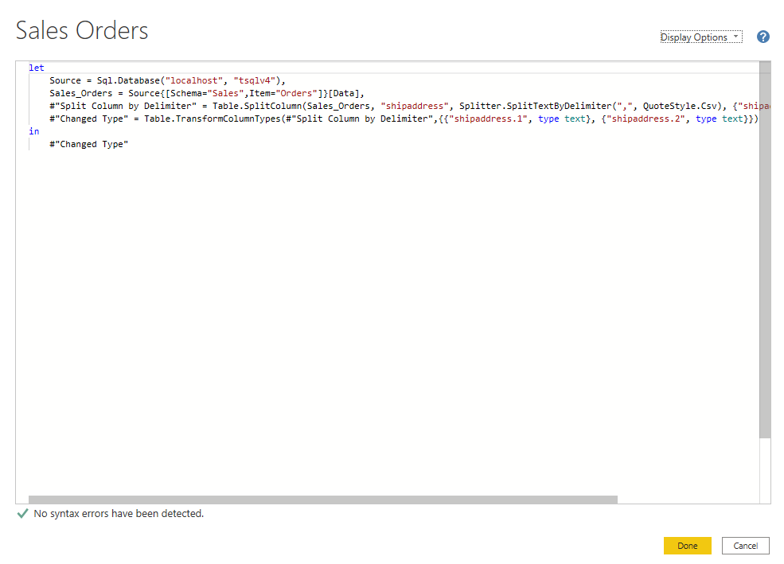

# Use Advanced Editor to modify M code

Each time you shape data in Power Query, you create a step in the Power Query process. Those steps can be reordered, deleted, and modified where it makes sense. Each cleaning step that you made was likely created by using the graphical interface, but **Power Query uses the M language behind the scenes**. 

The **M language** is always available to be read and modified directly.  It is not required that you use M code to take advantage of Power Query. You will rarely need to write M code, but it can still prove useful. Because each step in Power Query is written in M code, even if the UI created it for you, you can use those steps to learn M code and customize it to suit your needs.

M code is written top-down. Later steps in the process can refer to previous steps by the variable name to the left of the equal sign. Be careful about reordering these steps because it could ruin the statement dependencies. Write to a query formula step by using the in statement. Generally, the last query step is used as the in final data set result.

