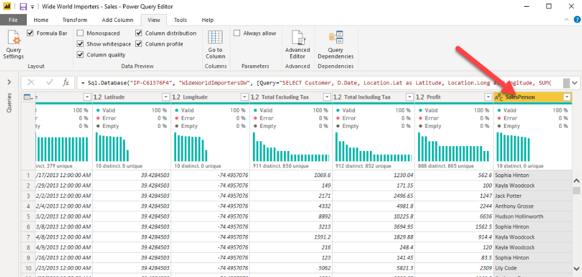

# Profile data in Power BI

Profiling data is about studying the nuances of the data: 
- determining anomalies
- examining and developing the underlying data structures
- querying data statistics such as:
    - row counts
    - value distributions
    - minimum and maximum values
    - averages
    - etc. 

This concept is important because it allows you to shape and organize the data so that interacting with the data and identifying the distribution of the data is uncomplicated, therefore helping to make your task of working with the data on the front end to develop report elements near effortless.

## Examine data structures

You can view the current semantic model under the **Model** tab on Power BI Desktop.

On the Model tab, you can edit specific column and table properties by selecting a table or columns, and you can transform the data by using the **Transform Data** button, which takes you to Power Query Editor. 

Additionally, you can manage, create, edit, and delete relationships between different tables by using **Manage Relationships**, which is located on the ribbon.

## Find data anomalies and data statistics

After you have created a connection to a data source and have selected Transform Data, you are brought to **Power Query Editor**, where you can determine if anomalies exist within your data. 

Select **View** on the ribbon, and under **Data Preview**, you can choose from a few options. To understand data anomalies and statistics, select the options:
- Column Quality
- Column Distribution
- Column Profile

**Column quality** shows you the percentages of data that is valid, in error, and empty. In an ideal situation, you want 100 percent of the data to be valid.

**Column distribution** shows you the distribution of the data within the column and the counts of distinct and unique values, both of which can tell you details about the data counts. Distinct values are all the different values in a column, including duplicates and null values, while unique values do not include duplicates or nulls.

NOTE. By default, Power Query examines the first 1000 rows of your data set. To change this, select the profiling status in the status bar and select **Column profiling based on entire data set**. 

