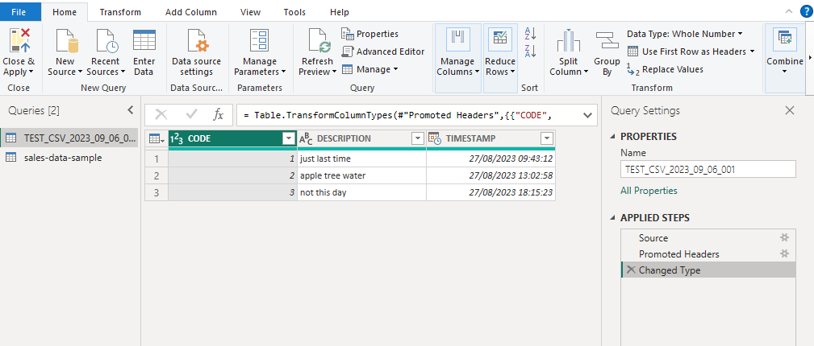

# Shape the initial data

**Power Query Editor** in Power BI Desktop allows you to shape (transform) your imported data. 

You can accomplish actions such as:
- renaming columns or tables
- changing text to numbers
- removing rows
- setting the first row as headers
- etc.

When you work in Power Query Editor, all steps that you take to shape your data are recorded. Then, each time the query connects to the data source, it automatically applies your steps, so your data is always shaped the way that you specified. 

You can see a list of your steps on the right side of the screen, in the **Query Settings** pane, along with the query's properties.

